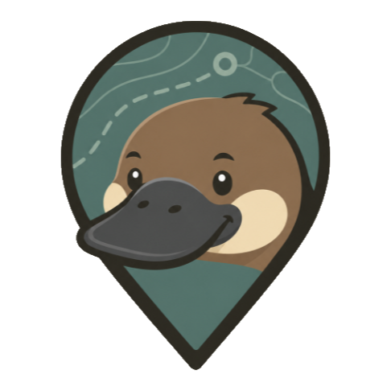
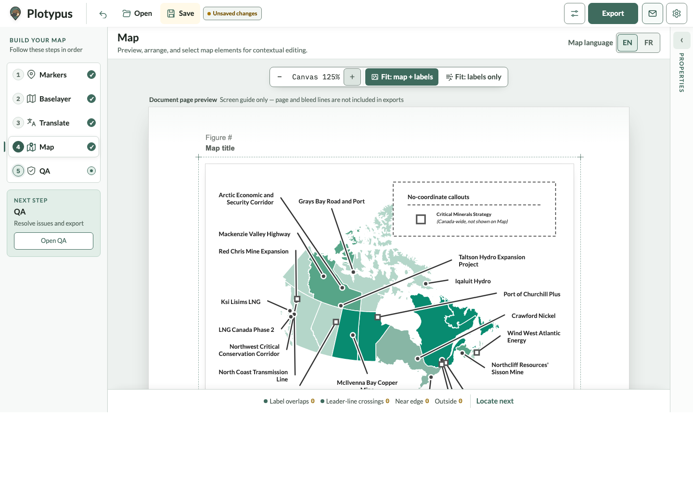
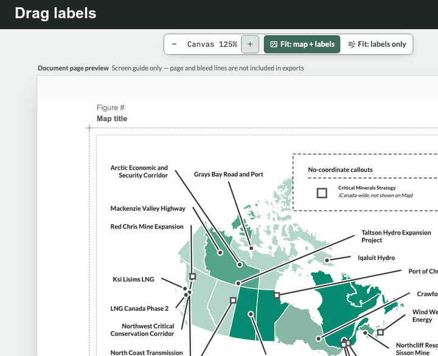
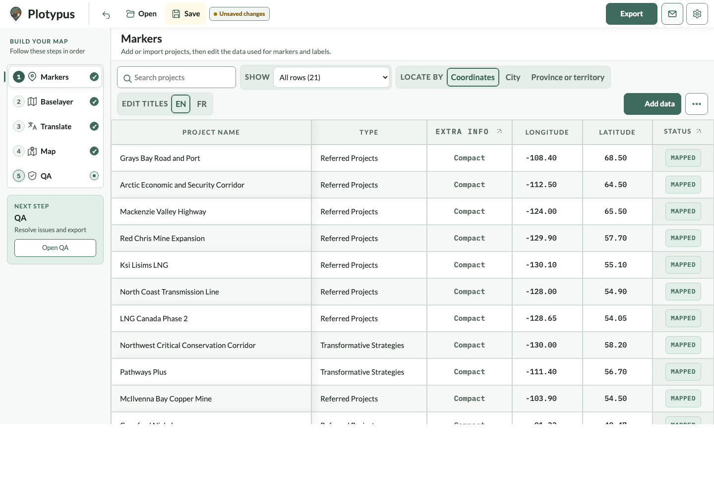
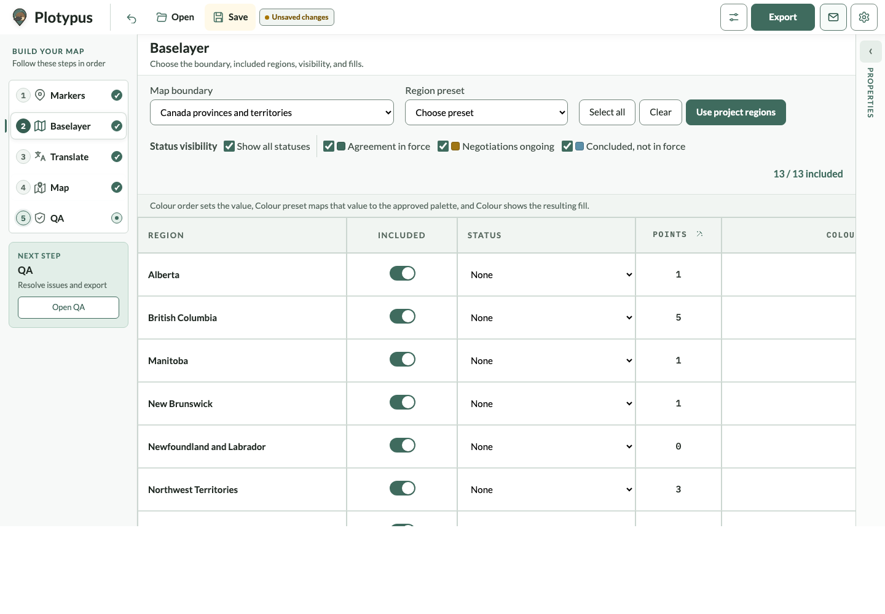
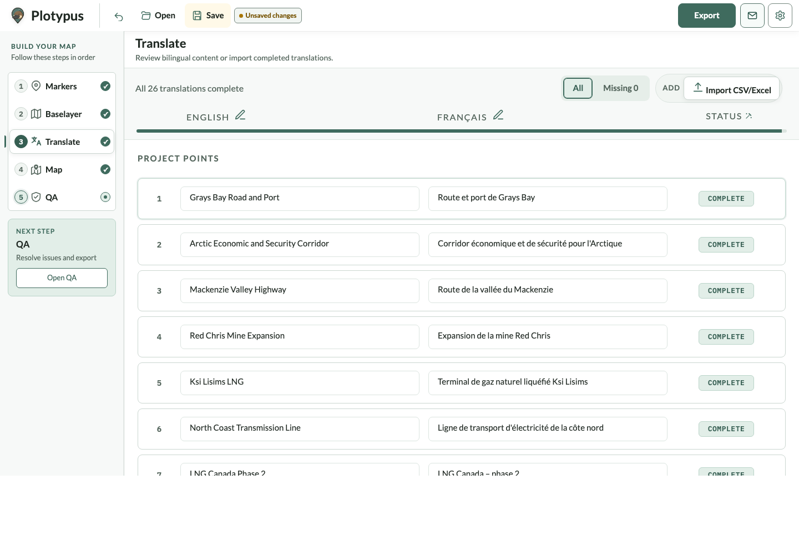
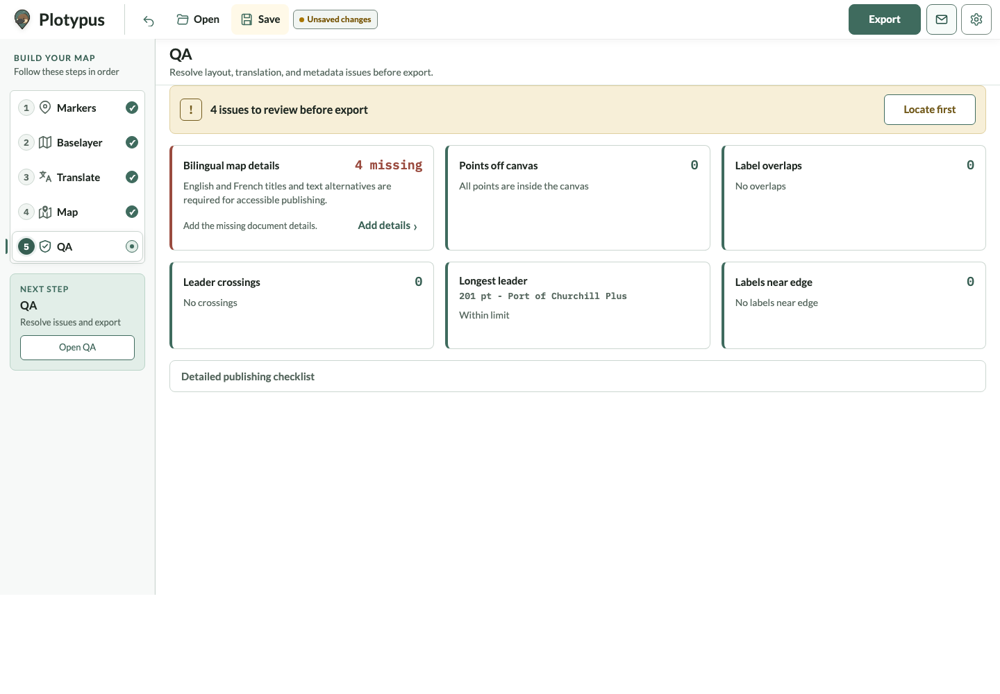

<p align="center">
  
</p>

<h1 align="center">Plotypus</h1>

<p align="center"><strong>Turn spreadsheet data into publication-ready static maps—without GIS software or a build step.</strong></p>

<p align="center">
  <a href="#setup">Setup</a> ·
  <a href="#what-plotypus-does">Features</a> ·
  <a href="#prepare-your-data">Data format</a> ·
  <a href="#configure-a-deployment">Server and configuration</a> ·
  <a href="CHANGELOG.md">Changelog</a>
</p>

<p align="center">
  <a href="LICENSE"></a>
</p>



Plotypus is a local-first browser app for policy, research, and communications teams creating fixed-layout maps for reports, briefings, websites, and print. Import CSV or Excel data, arrange markers and labels, review the result, and export SVG or PNG. The app runs entirely on your computer: no account, hosted service, or GIS toolchain is required.

Plotypus focuses on the last mile of map publishing—legible labels, controlled page dimensions, bilingual content, and repeatable output—rather than interactive map exploration.

## What Plotypus does

- **Starts with a spreadsheet.** Import CSV, TSV, or XLSX data, paste rows from a spreadsheet, or enter points directly.
- **Supports two location workflows.** Place projects with longitude and latitude, or attach them to named regions. Rows without coordinates can become map callouts.
- **Builds publication layouts.** Control page and canvas size, map scale, regional fills, marker categories, label wrapping, leader lines and colours, legends, and callouts.
- **Automates without taking over.** Run label auto-placement when you choose, then drag labels, markers, the map, legend, and callouts into their final positions. Manual placements remain intact until you run auto-place again.
- **Publishes in English and French.** Maintain bilingual project names, categories, map titles, and accessible text descriptions in one project.
- **Checks the map before export.** Review missing data and translations, label overlaps, leader-line crossings, off-canvas points, edge clearance, and other publishing issues.
- **Keeps projects portable.** Save the complete working state as JSON; uploaded marker icons and rich-label images are embedded in the project file.
- **Exports useful deliverables.** Download editable SVG for print, PNG for the web, or CSV for continued data work.

Runtime libraries, fonts, and Canada/world boundary data are bundled with the repository, so normal use works offline.

## See the workflow

### Arrange the map directly



Drag labels into place, move unlocked markers when coordinates need refinement,
and select the baselayer to resize it with visible handles and whole-percentage
feedback.

<table>
  <tr>
    <td width="50%">
      <a href="docs/screenshots/projects.png"></a><br>
      <strong>Bring in source data</strong><br>
      <sub>Edit spreadsheet rows and locations directly.</sub>
    </td>
    <td width="50%">
      <a href="docs/screenshots/regions.png"></a><br>
      <strong>Control the baselayer</strong><br>
      <sub>Choose regions, statuses, and colour order.</sub>
    </td>
  </tr>
  <tr>
    <td width="50%">
      <a href="docs/screenshots/translate.png"></a><br>
      <strong>Manage bilingual content</strong><br>
      <sub>Review English and French strings side by side.</sub>
    </td>
    <td width="50%">
      <a href="docs/screenshots/quality.png"></a><br>
      <strong>Review export readiness</strong><br>
      <sub>Locate layout and publishing issues before export.</sub>
    </td>
  </tr>
</table>

## Setup

### Use Plotypus offline

**Plotypus works fully offline with no installation, build step, account, or server.** It is a static application made from HTML, CSS, JavaScript, and bundled assets. Apart from a modern desktop browser, you do not need Node.js, Python, a package manager, a database, GIS software, or an internet connection.

All runtime libraries, fonts, map boundaries, and other required assets are included. After downloading the folder, it can be copied to an offline computer or removable drive and used there.

1. [Download the repository as a ZIP](https://github.com/BobPiromnam/Plotypus/archive/refs/heads/main.zip) and extract it, or clone it:

   ```text
   git clone https://github.com/BobPiromnam/Plotypus.git
   ```

2. Open `index.html` in Microsoft Edge, Chrome, or another modern desktop browser.
3. Select **Sample** to load the example project.
4. Select **Fit: map + labels**, refine the layout, and open **QA** to review it.
5. Select **Export** and download an SVG or PNG.

Project data stays in the browser unless you explicitly save, export, copy, or share a file.

### Optional: run from a server

A server is not required for normal offline use. Run Plotypus from a local or hosted static server when you want to load deployment overrides from `plotypus.config.json`, make it available to other people on a network, or publish it as a website.

On Windows, if Python is installed, the included launcher starts a local server and opens Plotypus:

```powershell
.\scripts\start-plotypus.ps1
```

Or start Python's static server directly on any platform:

```text
python -m http.server 8000
```

Then open <http://localhost:8000/>. For hosting, publish the repository folder through any static web server. There is no compiled output or separate build directory.

## Make a map

The five workspaces follow the publishing workflow:

1. **Markers** — add, paste, or import your source data. Choose coordinate or region-based locations.
2. **Baselayer** — choose Canada or the world, include the regions you need, and set fills, values, and statuses.
3. **Translate** — add or import French content and review missing translations.
4. **Map** — define legend items from Document Properties, choose the page and canvas size, run auto-placement, and make final adjustments directly on the canvas.
5. **QA** — resolve automated checks, locate layout problems, and complete the final human review.

For a new dataset, define the legend items in **Map** before importing rows so incoming `type` values can be matched correctly.

## Prepare your data

Plotypus recognizes common English and French column headings and lets you confirm their mapping during import.

| Column | When needed | Purpose |
| --- | --- | --- |
| `name` | Required | English project or label text |
| `type` | Required | Legend category ID or label; stable IDs are preferred for integrations |
| `lon`, `lat` | Coordinate mode | Decimal-degree longitude and latitude |
| `region` | Region mode | Province, territory, country, or other region name |
| `name_fr` | Optional | French project or label text |
| `type_fr` | Optional | French category text |
| `footnote` | Optional | Superscript footnote marker |
| `hideLine` | Optional | Hides the label's leader line when truthy |

Minimal coordinate example:

```csv
name,name_fr,type,type_fr,lon,lat
Grays Bay Road and Port,Route et port de Grays Bay,Referred Project,Projets soumis,-108.4,68.5
Critical Minerals Strategy,Stratégie sur les minéraux critiques,Transformative Strategy,Stratégies de transformation,,
```

When both coordinates are blank, the row is displayed as a no-coordinate callout. Accepted `hideLine` values include `yes`, `true`, `hide`, `hidden`, `no line`, and `no leader line`.

Three fictional datasets exercise each import location mode:

| Sample | Select during import | Location column |
| --- | --- | --- |
| [`sample-projects.csv`](samples/sample-projects.csv) | Coordinates | `lon`, `lat` |
| [`sample-projects-cities.csv`](samples/sample-projects-cities.csv) | City | `city` |
| [`sample-projects-provinces.csv`](samples/sample-projects-provinces.csv) | Province or territory | `region` |

The location choice in the mapping dialog applies to the complete import and replaces the current Project-point table. Switching an existing coordinate table to **Province or territory** derives containing regions where possible and keeps the original coordinates for switching back. Switching to **City** does not guess a nearest city; rows need an exact city selection from the offline catalogue. A selected city retains its exact catalogue coordinates and containing province when modes are changed. Province-only rows have no hidden point coordinates, so switching them to Coordinates leaves them as unlocated callouts until coordinates are supplied.

## Save, share, and export

Use **Save** to preserve the complete map as a self-contained Plotypus JSON project. Project files include source rows, styles, region settings, English and French layouts, resolved label positions, map furniture positions, and embedded image assets. Use **Open** to continue editing or share the JSON file with another Plotypus user.

Use CSV when you only need to exchange the project-point table. Use SVG for editable, print-oriented artwork and PNG for raster output.

Plotypus does not upload project data. Data leaves the page only when you save, export, copy, or otherwise share a file.

> [!IMPORTANT]
> Automated checks support editorial review; they do not replace it. Always inspect the final exported map before publication.

## Configure a deployment

Publishers can customize Plotypus without changing the application code.

| Layer | File | Purpose |
| --- | --- | --- |
| Bundled defaults | [`config.js`](src/config.js) | Keeps the app usable when opened directly from `file://` |
| Deployment overrides | [`plotypus.config.json`](plotypus.config.json) | Customizes a hosted or local-server deployment |

Configuration covers page and image sizes, fonts, map themes, category styles, approved colours, performance budgets, defaults, and sample data. Browsers commonly block sibling JSON reads from `file://`, so serve the folder locally when testing `plotypus.config.json`.

Read the [configuration guide](docs/configuration.md) for examples and the complete publishing workflow.

## Repository layout

The repository keeps deployable runtime files separate from development material:

| Directory | Contents |
| --- | --- |
| `src/` | Ordered browser scripts and first-party runtime libraries |
| `styles/` | Application design system and map theme stylesheets |
| `assets/` | Branding, offline fonts, and vendored third-party browser libraries |
| `data/` | Bundled city and boundary datasets |
| `samples/` | Example CSV files for each supported location workflow |
| `scripts/` | Local launch helpers |
| `tests/` | Unit, browser, accessibility, responsive, and visual checks |
| `tools/` | Repository validation and generated-data utilities |
| `docs/` | Current user/developer documentation and reviewed screenshots |

`index.html` and `plotypus.config.json` remain at the root because they are the application entry point and deployment-editable configuration.

## Contributing and support

Bug reports and focused improvements are welcome through [GitHub Issues](https://github.com/BobPiromnam/Plotypus/issues).

## License

Plotypus is available under the [MIT License](LICENSE).
